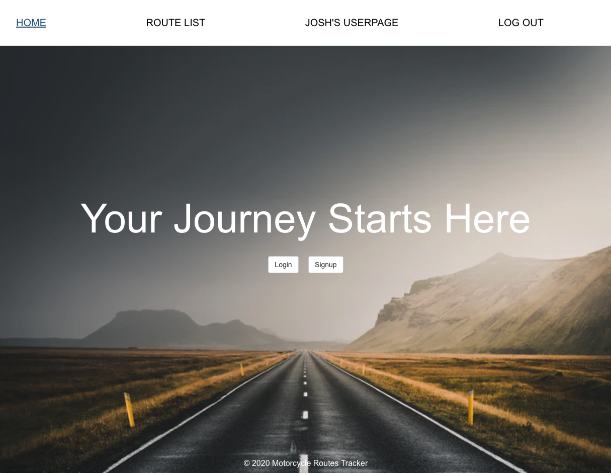

# Motorcycle-Routes-Tracker

This app is a place for motorcycle riders to track the routes that they themselves have done and to see what others have done. They can then see where to go next based on their skill set and/or the route's rating.

# Screenshots:

# Technologies Used:

* HTML
* CSS
* Javascript
* Mongo DB/ Mongoose
* Express
* React
* Node.js
* JWT-Based Authentication

# Getting Started: 

Checkout the site here => [Motorcycle-Routes-Tracker](https://motorcycle-routes.herokuapp.com/)

Trello Board => [Trello](https://trello.com/b/Weq8l3UI/sei-project-4)

# Next Steps: 

* Users can add their own photos of POI's in there routes
* Users can add commits to routes
* Users can "Like" routes
* Routes will have mini map in Details
* Style for mobile devices
